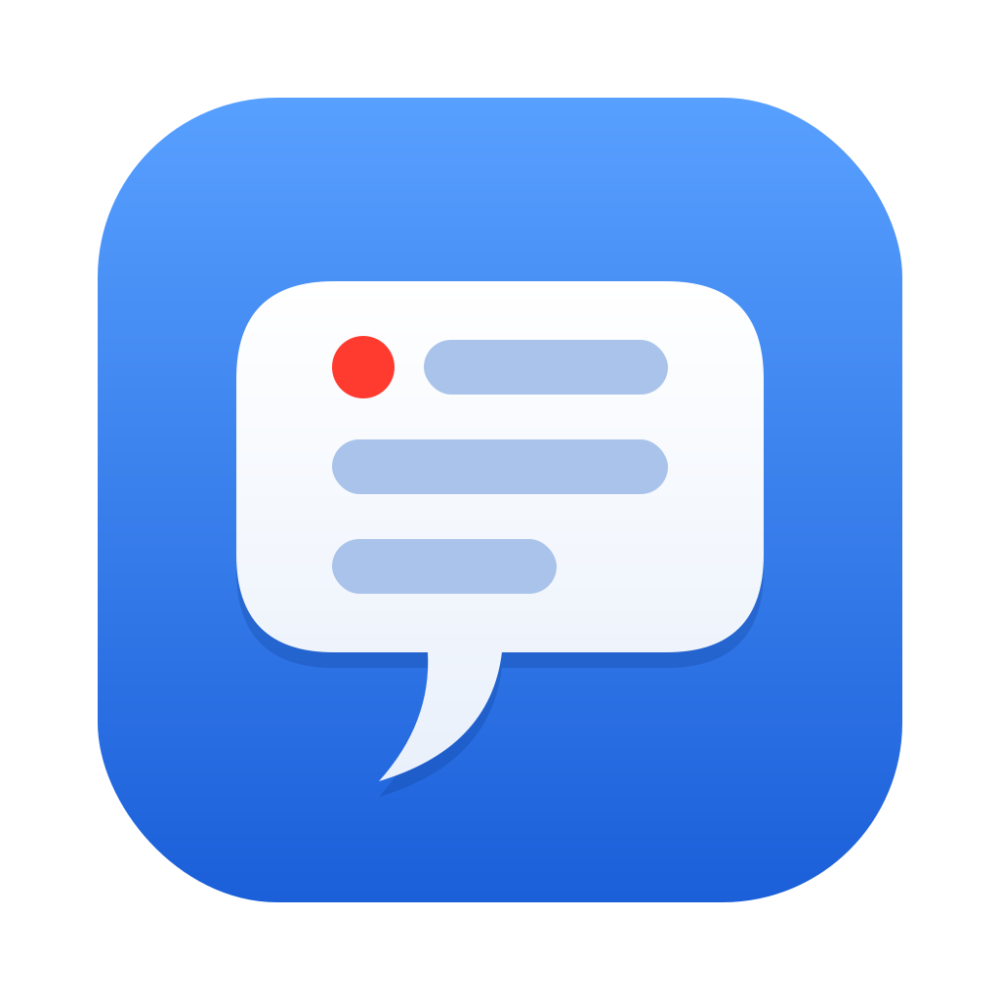
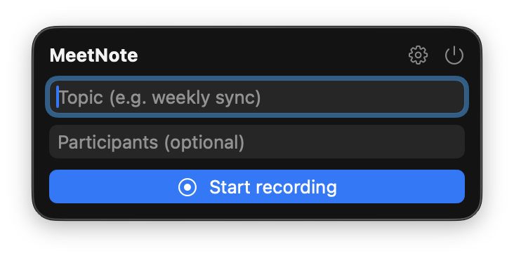

<p align="center">
  
</p>

# meetnote

Local meeting note-taker for this Mac. Records the mic **and** system audio
(the remote side of a Teams/Zoom/Meet call), transcribes both **on-device**
with Apple's SpeechAnalyzer (macOS 26+), and summarizes the transcript with a
**local** LM Studio model into a folder you choose. Nothing — audio, transcript,
or summary — ever leaves the machine.

Two front-ends over the same engine (`MeetnoteCore`):

- **`MeetNote.app`** — a menu bar app: click the icon → topic → Start;
  while recording it shows elapsed time, segment count and the last
  transcribed line; Stop → notes are written and opened. Settings
  (model, your name, output folder, system-audio self-test,
  start-at-login) sit behind the gear icon.
- **`meetnote`** — the CLI ([usage](#cli-usage)).

<p align="center">
  
</p>

## Quickstart

Requirements: **macOS 26+, Apple Silicon**, ~10–20GB free disk. 16GB RAM works
with the small model; 32GB+ is comfortable with the recommended one.

1. Install Xcode Command Line Tools: `xcode-select --install`
2. Install [LM Studio](https://lmstudio.ai) (free) and download a model:
   `google/gemma-4-26b-a4b` (best, needs 32GB+ RAM) or `google/gemma-4-12b-qat`
   (good, fine on 16GB). Start the server: `lms server start`.
3. Build and install:
   ```sh
   git clone <this repo> && cd meetnote
   ./scripts/make-app.sh                                         # menu bar app
   ln -sf "$PWD/.build/release/meetnote" ~/.local/bin/meetnote   # CLI (optional)
   open /Applications/MeetNote.app
   ```
4. Permissions (one-time): click Start once and allow the **Microphone**
   prompt, then add MeetNote to **System Audio Recording Only** — details
   in [App permissions](#app-permissions). Verify with the panel's
   **Test system audio** button.
5. In the panel's settings (gear icon), set your name and pick an output
   folder. If your meetings aren't in English, set the locale via CLI
   (`--locale ja_JP` etc. — supported: en/de/es/fr/it/ja/ko/pt/zh/yue
   variants; the speech model downloads automatically on first use).

## CLI usage

```sh
meetnote start weekly sync        # record; Ctrl-C to stop → transcript + notes
meetnote start standup --no-summary
meetnote summarize <transcript.md> [topic words…]
meetnote doctor                   # check permissions, models, LM Studio
```

Output goes to the configured folder (see Settings below):

- `YYYY-MM-DD-topic.md` — summarized notes (TL;DR, decisions, action
  items, open questions, discussion timeline)
- `transcripts/YYYY-MM-DD-HHMM-topic.md` — raw timestamped transcript

Speaker labels: **Me** = your mic, **Them** = system audio (everyone else on
the call, merged — individual remote speakers are not distinguished).

## Settings

The menu bar app's settings (behind the gear icon) cover your name (what
notes call "Me"), the output folder, and the summarization model. They're
stored in a shared defaults suite (`dev.livin.meetnote.shared`) that the CLI
reads too. Environment variables override everything:

| Variable | Default |
|---|---|
| `MEETNOTE_DIR` | panel setting, else `~/Documents/MeetNote` |
| `MEETNOTE_OWNER` | panel setting, else your macOS account name |
| `MEETNOTE_NAMES` | panel setting; comma-separated teammate names — hints the summarizer to repair names the speech recognizer misheard |
| `MEETNOTE_LMSTUDIO_URL` | `http://localhost:1234` |
| `MEETNOTE_MODEL` | panel pick, else auto: `google/gemma-4-26b-a4b` → qwen → first chat model |

## App permissions

The menu bar app is its own TCC identity — grant it permissions once:

- **Microphone** — prompted automatically on first Start.
- **System Audio Recording** — manual add (no automatic prompt): System
  Settings → Privacy & Security → Screen & System Audio Recording →
  *System Audio Recording Only* tab → `+` → add MeetNote. Without it the
  tap is created but **delivers silence** (no error).

⚠️ The bundle is ad-hoc signed, so **every rebuild invalidates the
system-audio grant** — after `make-app.sh`, re-toggle MeetNote in that pane.
Use the app's "Test system audio" button to confirm (it plays a sound and
checks the tap hears it; on silence it opens the right Settings pane).

## CLI permissions

macOS attributes the CLI's permissions to the app that launched it — i.e.
your terminal app, not meetnote itself. Grant your terminal the same two
permissions (same Settings pane as above). `meetnote doctor` detects the
silent-tap case by playing a test sound through the tap. If you launch
meetnote from a different terminal app, that app needs the same grants.

## Summarization

`meetnote start` expects LM Studio's server to be up (`lms server start`); the
model is JIT-loaded on the first request. If the server is down, the transcript
is still saved and the command tells you how to summarize it later. Long
transcripts are map-reduced in ~16k-char chunks.

## Build notes

`scripts/make-app.sh` builds everything in release mode and installs the app;
`swift build -c release` alone builds the CLI (CLT only, no Xcode/Homebrew/deps
needed). `Resources/Info.plist` is embedded into the CLI binary
(`__TEXT,__info_plist`) for the TCC usage descriptions. Debug logging:
`MEETNOTE_DEBUG=1`.

## Etiquette

Tell people they're being transcribed. Recording laws vary by jurisdiction.
